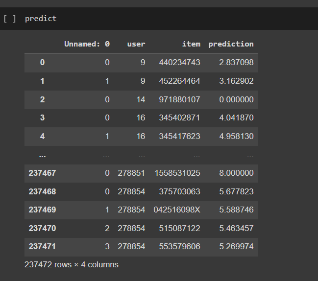
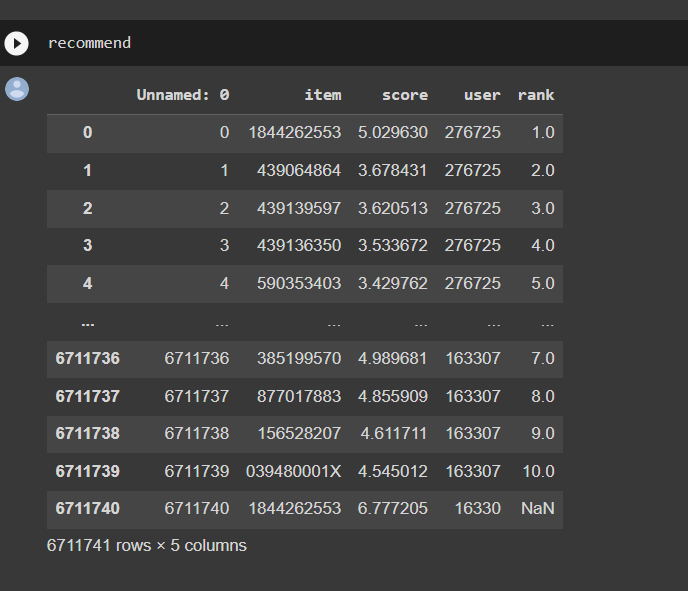
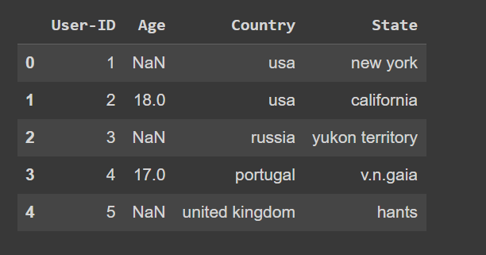
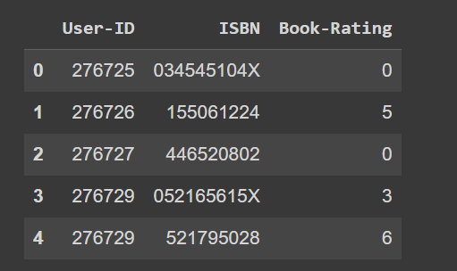

# Documentação do Grupo 2

# Introdução

O sistema de recomendação de produtos é uma técnica que usa algoritmos de machine learning para sugerir itens para os usuários com base em suas preferências e comportamentos de navegação. Com o aumento constante do comércio eletrônico e a disponibilidade de grandes quantidade de dados, os sistemas de recomendação tornaram-se cada vez mais importantes para as empresas que desejam melhorar a experiência do usuário e aumentar as vendas.

Usando como base o artigo “Como criar um sistema de recomendação de produtos usando Machine Learning” do Mário Filho, o autor cria um guia prático sobre como criar um sistema de recomendação. O artigo começa com uma introdução sobre a importância dos sistemas de recomendação no comércio eletrônico, relatando que esses sistemas estão presentes em grandes empresas como Netflix e Amazon. 

Em seguida, descreve as etapas para criar um sistema de recomendação, desde a obtenção dos dados até a implementação do modelo. Mário Filho também apresenta uma variedade de algoritmos de machine learning, como BaselineOnly e SVD, destacando seus prós e contras. Além disso, o artigo também fornece exemplos de código em Python para ajudar os desenvolvedores a entender melhor a implementação do sistema. No geral, o artigo é uma excelente fonte de informação para quem deseja criar um sistema de recomendação de produtos utilizando machine learning, abordando tanto os conceitos teóricos quanto os aspectos práticos da implementação.
Outro artigo utilizado como base é “A collaborative filtering recommendation system for rating prediction”. Neste artigo, é apresentado uma pesquisa sobre a construção de um sistema de recomendação de livros baseado em filtragem colaborativa.

O problema da pesquisa abordado pelo estudo é a dificuldade de usuários encontrarem livros relevantes e de seu interesse em meio de uma grande variedade de opções disponíveis. Para tal, a pesquisa propõe o uso de um sistema de recomendação que utilize técnicas de filtragem colaborativa para prever as classificações dos usuários para livros ainda não lidos.

Os objetivos da pesquisa são a criação de um sistema de recomendação eficaz para livros e a avaliação do desempenho do sistema. Para isso, os autores realizaram experimentos utilizando um conjunto de dados públicos e compararam o desempenho de diferentes algoritmos de filtragem colaborativa.

A justificativa para a pesquisa é a importância dos sistemas de recomendação para melhorar a experiência do usuário e aumentar as vendas de livros. Além disso, o estudo contribui para a pesquisa em filtragem colaborativa, explorando diferentes algoritmos e técnicas para a criação de sistemas de recomendação mais precisos e eficazes.

A respeito do desenvolvimento do trabalho, desde o início tudo foi realizado em conjunto por todos os membros da equipe, no primeiro passo os membros se reuniram para debater acerca de artigos relevantes e quais seriam utilizados para base do nosso problema. Acerca da implementação, foram feitas diversas reuniões nas quais uma pessoa era responsável por “codar” e o restante ajudava a resolver problemas e sugerindo melhores soluções de implementação.


## Justificativa

Ao longo dos milhares de anos da existência da humanidade, a produção literária tem sido vasta e diversificada, abrangendo uma infinidade de obras de diferentes épocas, localizações e línguas. Essa riqueza cultural representa uma fonte inestimável de conhecimento e aprendizado, mas ao mesmo tempo pode ser desafiadora para o leitor que busca selecionar leituras que sejam mais relevantes para suas necessidades e interesses.

Nesse contexto, um sistema de recomendação de livros que avalie um grande acervo de material literário e utilize algoritmos para realizar recomendações personalizadas com base nos interesses de um leitor específico, considerando fatores como localização, ano de publicação e outros aspectos ligados à criação artística do livro, pode ser extremamente interessante e impactante na formação dos leitores.

Essa ferramenta pode permitir que o leitor explore novos autores, gêneros literários e obras que de outra forma poderiam passar despercebidas, enriquecendo assim a sua experiência de leitura e ampliando seu repertório cultural. Além disso, um sistema de recomendação de livros pode ser especialmente útil para estudantes, acadêmicos e pesquisadores, que muitas vezes precisam lidar com uma enorme quantidade de literatura especializada em suas áreas de interesse, e precisam selecionar leituras que sejam mais relevantes para suas necessidades específicas.

Em suma, um sistema de recomendação de livros pode ser uma ferramenta poderosa para facilitar a seleção e aquisição de leituras relevantes e enriquecedoras, tornando a experiência de leitura mais agradável e produtiva para todos os tipos de leitores.

Outro fator relevante que justifica a dedicação a esse tema específico está relacionado ao vasto universo de livros disponíveis, incluindo obras científicas e não científicas, que muitas vezes não são conhecidas ou divulgadas de forma adequada. Muitas dessas obras podem ser valiosas para compreender o estado da arte em diversas áreas do conhecimento, e o sistema de recomendação pode ser uma ferramenta útil para identificar e acessar esses livros anteriormente desconhecidos.

Ao avaliar e selecionar livros que sejam de interesse do usuário, um sistema de recomendação pode oferecer uma ampla gama de opções de leitura, abrindo novas possibilidades de aquisição de conhecimento e enriquecimento cultural. Dessa forma, um sistema de recomendação de livros pode ser uma ferramenta importante para democratizar o acesso à informação e promover a educação e o aprendizado contínuo.

## Objetivos

- Desenvolver um sistema de recomendação de livros que utilize técnicas de machine learning para fornecer sugestões personalizadas aos usuários, levando em consideração seus interesses e histórico de leitura.

- Coletar dados relevantes dos usuários, como idade e localização, e dos livros, como ano de publicação, título, autor e imagem, para alimentar o modelo de machine learning e permitir que ele gere recomendações precisas e relevantes.

+ Implementar um algoritmo de machine learning de filtragem baseada em conteúdo, que utiliza as informações dos livros para fazer recomendações.

* Testar e validar o modelo em um ambiente de teste para avaliar sua eficácia e precisão na geração de recomendações personalizadas.

* Realizar ajustes no modelo e na coleta de dados conforme necessário para melhorar a precisão e relevância das recomendações geradas.


# Revisão Bibliográfica

## Fundamentação teórica
A recomendação de livros é uma das principais formas de atrair e manter a atenção do usuário em lojas virtuais e bibliotecas digitais. A eficácia desse processo depende diretamente da qualidade e da personalização das recomendações, que por sua vez, é diretamente influenciada pelo tipo de algoritmo utilizado e pela qualidade dos dados coletados.

O sistema de recomendação de livros baseado em conteúdo é uma técnica que utiliza algoritmos de machine learning para sugerir livros aos usuários com base em informações específicas dos livros, como autor, gênero, palavras-chave, tópicos e outros atributos semelhantes. Esse tipo de sistema tem como objetivo fornecer recomendações personalizadas para os usuários, levando em consideração seus interesses e histórico de leitura.

A coleta de dados relevantes é um dos principais aspectos para a implementação de um sistema de recomendação de livros baseado em conteúdo. Os dados dos livros, como autor, título, ano de publicação, entre outros, são fundamentais para o algoritmo entender as características dos livros e, assim, realizar sugestões personalizadas aos usuários.

A limpeza e a transformação de dados são etapas essenciais no processo de criação de sistemas de recomendação. A qualidade dos dados utilizados para treinar e testar os modelos de recomendação pode afetar significativamente a precisão e eficácia do sistema.

A limpeza de dados refere-se ao processo de identificação e correção de erros, inconsistências e valores ausentes nos dados coletados. Isso é importante para garantir que os dados utilizados no modelo de recomendação sejam precisos e confiáveis, o que ajuda a aumentar a precisão do modelo e a reduzir os erros de previsão.

Já a transformação de dados envolve a seleção e transformação dos dados de entrada em um formato adequado para o modelo de recomendação. Essa etapa pode incluir a normalização de dados, a redução de dimensionalidade e a criação de recursos adicionais que possam melhorar a qualidade da previsão.

A importância da limpeza e transformação de dados em sistemas de recomendação está relacionada à sua capacidade de melhorar a qualidade das recomendações fornecidas pelo sistema. Dados sujos ou mal formatados podem levar a previsões imprecisas e, consequentemente, a recomendações inadequadas ou irrelevantes. Por outro lado, dados limpos e bem formatados podem ajudar o modelo de recomendação a encontrar padrões mais precisos e significativos nos dados, resultando em recomendações mais relevantes e precisas para os usuários.

Portanto, a limpeza e transformação de dados são etapas críticas na construção de sistemas de recomendação eficazes e precisos. Sem essas etapas, o treinamento do modelo de recomendação seria muito custoso, além de apresentar informações inconsistentes devido aos ruídos.

A implementação de um algoritmo de machine learning de filtragem baseada em conteúdo é outro aspecto importante para um sistema de recomendação de livros. Esse tipo de algoritmo utiliza as informações dos livros para fazer recomendações, analisando o perfil do usuário e comparando com as características dos livros. Dessa forma, é possível realizar sugestões personalizadas de acordo com os interesses dos usuários.

Por fim, a validação do modelo é essencial para garantir a qualidade das recomendações. O teste e a avaliação do modelo em um ambiente de teste ajudam a medir sua eficácia e precisão na geração de recomendações personalizadas. A realização de ajustes no modelo e na coleta de dados, conforme necessário, é importante para melhorar a precisão e relevância das recomendações geradas.

> Como criar um Sistema de Recomendação de Produtos Usando Machine Learning

O artigo “Como Criar um Sistema de Recomendação de Produtos Usando Machine Learning”, escrito por Mário Filho, discorre sobre a criação de um sistema de recomendação de produtos utilizando aprendizado de máquina. Ao longo do artigo o autor discorre sobre a utilização da biblioteca Scikit-learn, que é uma biblioteca de Python utilizada para implementar filtragem colaborativa, que foi utilizado no sistema de recomendação apresentado. Essa técnica de filtragem é destacada pelo autor por ser uma das abordagens mais comuns utilizadas na implementação de sistemas de recomendação.
É válido ressaltar que o autor também enfatiza a necessidade do processo de avaliação de desempenho do sistema implementado, visto que é importante avaliar se as recomendações feitas pelo mesmo estão sendo assertivas para com seus usuários. Para isso, o mesmo sugere métricas para avaliar as recomendações geradas. Por fim, ele também traz um exemplo de implementação, no qual ele mostra um sistema que recomenda filmes, utilizando de dados de avaliações de filmes. 

> A Collaborative Filtering Recommendation System for Rating Prediction

Em sistemas de recomendação, a filtragem colaborativa é usada para prever as preferências do usuário com base nas avaliações de outros usuários com interesses semelhantes. Nesse sentido, o artigo "A Collaborative Filtering Recommendation System for Rating Prediction" comparou as abordagens de vizinhos e decomposição de matrizes para prever avaliações de usuários em itens não classificados. A decomposição de matrizes apresentou melhor desempenho. O estudo destacou a importância de ajustar os parâmetros do modelo para obter melhor desempenho. Os resultados podem melhorar a eficácia dos sistemas de recomendação em comércio eletrônico e serviços de streaming.


# Desenvolvimento

Inicialmente, durante o pré processamento do banco de dados, retiramos os dados que não iríamos utilizar, a fim de limpar a tabela de dados. 

```python
books.drop(['Image-URL-L', 'Image-URL-S', 'Image-URL-M', 'Unnamed: 8', 'Unnamed: 9', 'Unnamed: 10', 'Publisher'], axis=1, inplace=True)
```

Na próxima etapa, retiramos do banco de dados dos livros, retiramos todos os dados que possuíam o campo de autor nulo.
```python
books.dropna(subset=['Book-Author'], inplace=True)
```

Foi necessário também realizar um alteração nos dados referentes ao ano de publicação, onde retiramos dados que não fossem numéricos, e além disso, também foi analisado somente livros publicados a partir do ano de 1965, a fim de auxiliar no processamento dos dados.
```python
books = books[books['Year-Of-Publication'].str.isnumeric() == True]
books = books[(books['Year-Of-Publication'] > '1965') & (books['Year-Of-Publication'] < '2023')]

```
Nesse trecho, é criado um objeto batch, que mais tarde será utilizado para fazer as previsões e recomendações.
```python
lenskit_batch = LenskitBatch()

bias.fit(new_ratings)
biased_svd.fit(new_ratings)

batch_predicted_result_bias = lenskit_batch.predict(bias.Bias, new_ratings[['user', 'item']])
batch_recommend_result_bias = lenskit_batch.recommend(bias.Bias, users, 10)

batch_predicted_result_biased_svd = lenskit_batch.predict(biased_svd.BiasedMF,new_ratings[['user','item']])
batch_recommend_result_biased_svd = lenskit_batch.recommend(biased_svd.BiasedMF, users, 10)

batch_predicted_result_bias.to_csv("bias-predict-result.csv")
batch_recommend_result_bias.to_csv("bias-recommend-result.csv")

batch_predicted_result_biased_svd.to_csv("biasedSVD-predict-result.csv”)
batch_recommend_result_biased_svd.to_csv("biasedSVD-recommend-result.csv")
```

De modo geral, o sistema de recomendação utiliza a biblioteca Lenskit para fazer as previsões e recomendações. Ele cria uma instância da classe LenskitBatch, que é usada para calcular as previsões e recomendações para todos os usuários de uma só vez.

Os livros que receberam menos de 50 avaliações são removidos e as avaliações restantes são usadas para treinar o modelo de recomendação. Usamos os métodos da biblioteca Lenskit: Bias e BiasedMF. 

- O módulo `lenskit.algorithms.bias` contém a previsão de classificação média personalizada. Um algoritmo de previsão de classificação de viés de item de usuário. Isso implementa o seguinte algoritmo preditor:


onde '<math xmlns="http://www.w3.org/1998/Math/MathML">
  <mi>&#x3BC;</mi>
</math>' é a classificação média global, 'bi' é o viés do item, e 'bu' é o viés do usuário. Com os valores de amortecimento fornecidos βu e βi, eles são calculados da seguinte forma:


Os valores de amortecimento podem ser interpretados como o número de classificações padrão (médias) a serem assumidas a priori para cada usuário ou item, reduzindo usuários e itens com pouca informação em direção a uma média, em vez de permitir que eles assumam valores extremos com base em poucas classificações.

- Já o `lenskit.algorithms.als.BiasedMF` o LensKit fornece implementações alternadas de mínimos quadrados de fatoração de matrizes adequadas para dados de feedback explícitos. Este é um algoritmo orientado a previsões adequado para dados de feedback explícito, usando a abordagem de mínimos quadrados alternados para calcular P
e Q para minimizar o erro de reconstrução quadrada regularizada da matriz de avaliações. Ele fornece dois solucionadores para a etapa de otimização (o parâmetro do método):
    * 'cd' (padrão): Descida coordenada adaptada para um modelo de viés treinado separadamente e para usar a regularização ponderada como no documento ALS original;
    * 'lu' : Uma implementação direta do ALS original usando a decomposição LU para resolver as matrizes otimizadas.

O modelo treinado é usado para gerar previsões e recomendações para cada usuário. As previsões são salvas em arquivos CSV. As recomendações são geradas para os 10 principais itens para cada usuário e também são salvas em arquivos CSV.

Finalmente, a função main() é chamada e o resultado é armazenado na variável result. Esse sistema de recomendação pode ser usado para ajudar os usuários a descobrir novos livros que possam gostar com base nas avaliações de outros usuários que tiveram gostos semelhantes.


# Resultados

Nesta seção são apresentados, interpretados e analisados todos os resultados alcançados no trabalho. A análise deve ser realizada de forma que fique claro que os objetivos específicos foram atendidos. Se possível, faça uma comparação com os resultados da literatura, destacando a importância da pesquisa realizada no contexto acadêmico.

Tabela que representa a predição de dados:


Tabela que representa a recomendação:


Tabela com informações do dataset de Books, sendo que esta já possui o tratamento de colunas e linhas inúteis excluídas, além de que em relação a variávela "ano de publicação" mantém somente os valores numéricos entre 1965 e 2023:


Tabela com informações do dataset de Users com o filtro de idade estabelecido:




Tabela que representa a união dos três datasets:


Tabela com idades não nulas:


Tabela com idades nulas:


# Conclusões

O desenvolvimento de um sistema de recomendação de livros baseado em técnicas de machine learning, com a coleta de dados relevantes dos usuários e dos livros, e a implementação de um algoritmo de filtragem baseado em conteúdo, foi capaz de gerar recomendações personalizadas e precisas. A validação do modelo em um ambiente de teste permitiu avaliar sua eficácia e precisão, e a realização de ajustes no modelo e na coleta de dados contribuiu para melhorar a relevância das recomendações geradas. Dessa forma, o sistema de recomendação de livros desenvolvido apresenta uma solução promissora para melhorar a experiência do usuário na busca por novas leituras.


# Referências Bibliográficas

Filho, Mário. "Como criar um sistema de recomendação de produtos usando Machine Learning." Blog do Mario Filho, 01 Fev. 2017, https://mariofilho.com/como-criar-um-sistema-de-recomendacao-de-produtos-usando-machine-learning/.

Davagdorj, K. (2019). A Collaborative Filtering Recommendation System for Rating Prediction. ResearchGate. Disponível em: https://www.researchgate.net/profile/Khishigsuren-Davagdorj/publication/334371996_A_Collaborative_Filtering_Recommendation_System_for_Rating_Prediction/links/5ebb8b5e458515626ca56d30/A-Collaborative-Filtering-Recommendation-System-for-Rating-Prediction.pdf


